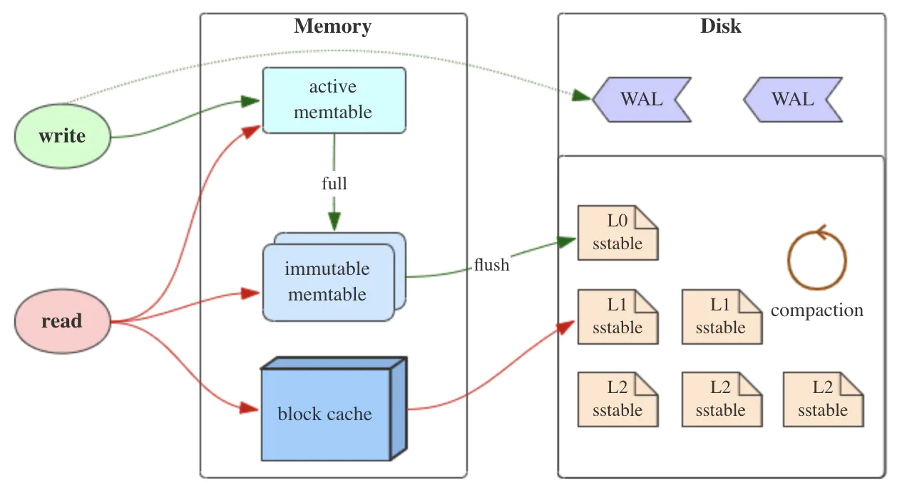
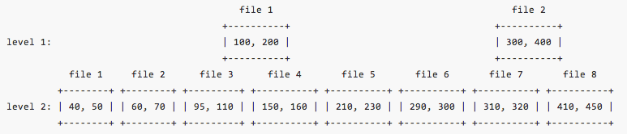

### rocksdb 读写

- wal: write ahead log
  it can be used to completely recover the data in memtable

  > Options::wal_dir: the directory to store wal files
  > Options::wal_ttl: the timeout to delete the wal file 

- memtable: the write cache of rocksdb  
- block cache: the read cache of rocksdb

> when write, it write memtable and wal at the same time  
> when read, it will read  memtable and block cache first, then read sstable

> by default, when we flush the memtable to table file, we also delete the wal file, since we don't need it anymore for recovery(the data from the log is "persisted" in table file)

### sst file(sstable)
- sst: sorted string table
- lsm tree: Log Structured Merge Tree

On level 0, files are sorted based on the time they are flushed. Their key range (as defined by FileMetaData.smallest and FileMetaData.largest) are mostly overlapped with each other. So it needs to look up every L0 file. As a result, key/values are moved from L0 down the LSM tree gradually. Compaction sorts key/values and split them into files. From level 1 and below, SST files are sorted based on key

Compaction is scheduled periodically to pick up files from an upper level and merges them with files from lower level

Internally, each SSTable contains a sequence of blocks (typically each block is 64KB in size, but this is configurable). A block index (stored at the end of the SSTable) is used to locate blocks; the index is loaded into memory when the SSTable is opened

**space amplification= size_on_file_system / size_of_user_data**

### compaction & compression
- compaction options
1. options::disable_auto_compactions
disable automatic compaction

2. options.compaction_style 
enable/disable compaction and set compaction style

3. options.compaction_pri 
indicated different algorithms to pick files to compact

- other  
dynamic level size target mode: enable it by set  *options.level_compaction_dynamic_level_bytes=true*.

level-based compaction
level's size target

